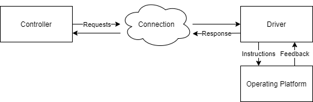

# mindstone

## Introduction
The mindstone library provides a framework for designing and implementing robots or agents control that is modularised, scalable and simple to implement. Housing a collection of tools and models, the mindstone library can be used to effectively create control models for anything from automating basic task automation to controlling robots. 

The goal of the mindstone project is to develop one tool that can be used by people to create robots or autonomous that can reliably operate in a variety of circumstances.


## Installation
Installing using python's [pip](https://pip.pypa.io/en/stable/quickstart/):
```commandline
pip install mindstone
```
or from Github using [setuptools](https://pypi.org/project/setuptools/) from Github:
```commandline
git clone https://github.com/joshuasello/mindstone.git
cd mindstone
python setup.py install
```


## How it works
Generally, there are two parts to controlling a robot, the processing of input and other sources of data and the execution of tasks on a hardware level. When implementing the control of a system, the mindstone framework uses an object called a controller. The controller defines the operations that are used by an agent and the agent's behaviour. Another object called a driver handles the execution of tasks requested by the controller and also provides observational input that can be used by the controller to make decisions. During the runtime of an agent, these two objects will communicate back and forth to each other to effectively operate within the real world.

The figure below provides an overview of how the system is structured. The system is implemented this way so that the controller is able to run completely independent of the driver on different devices.



## The driver
### Starting a new driver
The driver runs on the device that will be directly executing tasks on hardware components, acting as an interface between a connected controller and the platform it operates on. When activated, the driver starts a server to host incoming requests from controllers.

```python
from mindstone import driver

if __name__ == '__main__':
    driver.run(platform="rpi", port=50000)
``` 

The `platform` argument tells the driver what platform it is running on:
- `rpi`: Raspberry Pi Platform
- `dummy`: Dummy Platform (useful for testing)

The `port` argument tells the connection server what port it is serving on.

To connect to the driver from another device you'll need to get the device's IP address. On linux systems this can be done by typing the following command into the terminal:
```commandline
$ hostname -I
```

## Driver components
Component objects act as interfaces between the driver and the electronics wired up to the main device.

|Tag            |Component          |Required Setup Arguments           |Optional Setup Arguments                                                                                           |
|---------------|-------------------|-----------------------------------|-------------------------------------------------------------------------------------------------------------------|
|`trigger`      |Trigger/LED/Motor  |`trigger_pin: int`                 |None                                                                                                               |
|`switch`       |Switch/Button      |`input_pin: int`                   |None                                                                                                               |
|`servo`        |Servo/Button       |`trigger_pin: int`                 |`frequency: float = 50`, `start_on_time: float = 0.0005`, `end_on_time: float = 0.0025`, `max_angle: float = 180`  |
|`ultrasonic`   |Ultrasonic Sensor  |`trigger_pin: int`, `echo_pin: int`|`trigger_pw: float = 0.00001`, `measurements: int = 1`                                                             |